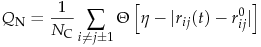
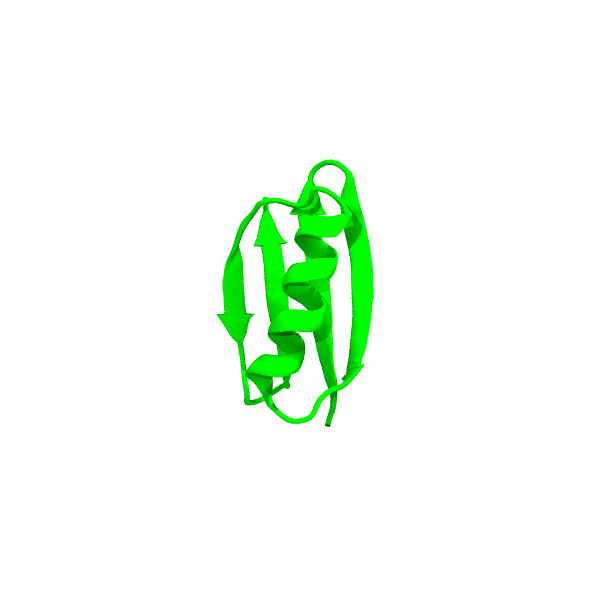
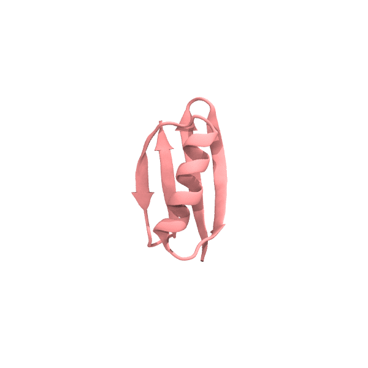
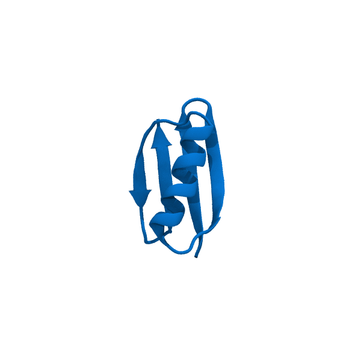
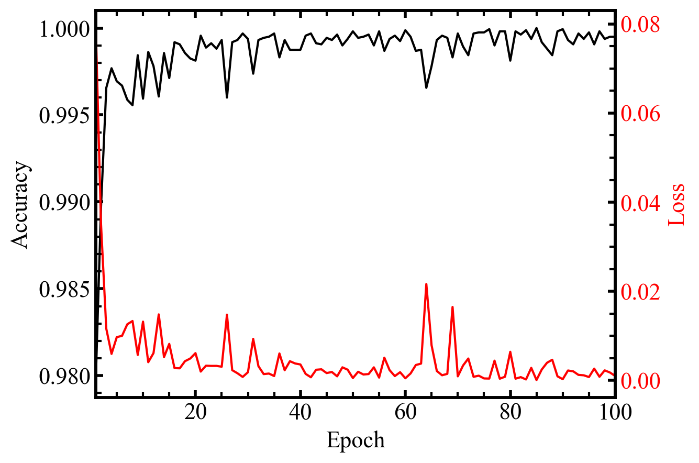
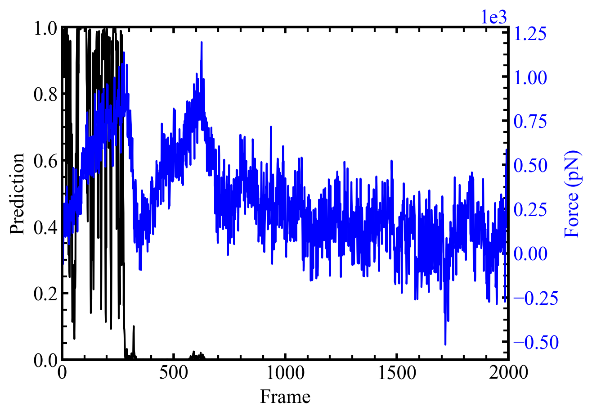
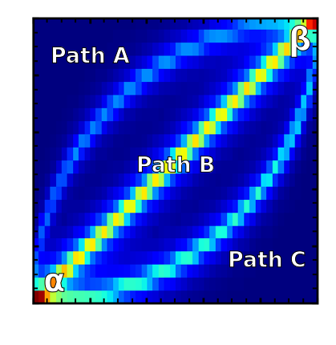
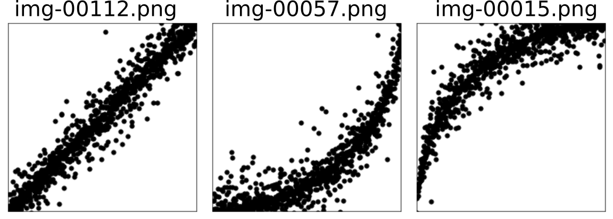

# ez-mlmd
Quick and easy application of machine learning to molecular dynamics trajectories

### 1. ez-native.py
The structure of protein comparing to its native state is usually estimated by fraction of native contacts:



However, the tolerance of distance fluctuation is set to be uniform for all native contacts, which are composed of different amino acid pairs with different significance of interactions.

Here, a different approach is proposed to determine whether the protein is in its native state based on supervised machine learning of its equilibration trajectories at different temperatures. Specifically, the Cartesian coordinates of heavy atoms in each frame will be used as training sets. All frames simulated at 300K will be labeled as in "native state" (`1`) and structures at 600K will be considered as "unfolded" (`0`). 

Currently only criteria of nativeness is calculated but advanced applications such as feature extraction can be added when necessary, since all the coordinates are retrieved based on current implementation.


Equilibrations at 300K (green) and 600K (pink) will be used for training.




A steered molecular dynamics (SMD) trajectory is used for prediction. Note that the protein is considered as non-native immediately after the first unfolding event.



### Example output

```
Using TensorFlow backend.
Instructions for updating:
Colocations handled automatically by placer.
_________________________________________________________________
Layer (type)                 Output Shape              Param #
=================================================================
dense_1 (Dense)              (None, 56)                73304
_________________________________________________________________
dense_2 (Dense)              (None, 28)                1596
_________________________________________________________________
dense_3 (Dense)              (None, 14)                406
_________________________________________________________________
dense_4 (Dense)              (None, 1)                 15
=================================================================
Total params: 75,321
Trainable params: 75,321
Non-trainable params: 0
_________________________________________________________________
None
---------------
Accuracy = 1.00
---------------
```




### 2. ez-cluster.py
When study protein folding, hundreds of trajectories might be used to study all possible folding pathways. However, it is not feasible to examine each plot to determine the partition information of different pathways. For example, considering the following transition from α to β, there are three major pathways. What are the percentage of each pathway?



Here, an unsupervised learning method is proposed to determine the percentage of each pathway.

It is recommended to generate the training set with same image size and minimum noise for better data preprocessing. The following example code (using `matplotlib`) will make image size 256 x 256px
```
import matplotlib.pyplot as plt
ax = plt.gca()
ax.set_aspect(1.0)
ax.get_xaxis().set_visible(False)
ax.get_yaxis().set_visible(False)
plt.savefig("img/img-%05d.png"%(i+1), dpi=64, bbox_inches='tight')
plt.close()
```

200 pathway images was generated for testing, with 40 for path A, 100 for path B and 60 for path C. These images were first feed to autoencoder built with 6 layers in Keras, then the encoded layer was used for K-mean clustering to determine the partition of each pathway.

The clustering gives consistent results after 10 epochs:
```
Using TensorFlow backend.
Instructions for updating:
Colocations handled automatically by placer.
Instructions for updating:
Use tf.cast instead.
Epoch 1/10
200/200 [==============================] - 24s 119ms/step - loss: 0.5279 - acc: 0.6860
Epoch 2/10
200/200 [==============================] - 23s 116ms/step - loss: 0.3620 - acc: 0.8367
Epoch 3/10
200/200 [==============================] - 23s 116ms/step - loss: 0.2981 - acc: 0.8617
Epoch 4/10
200/200 [==============================] - 24s 121ms/step - loss: 0.2505 - acc: 0.8715
Epoch 5/10
200/200 [==============================] - 24s 118ms/step - loss: 0.2206 - acc: 0.8747
Epoch 6/10
200/200 [==============================] - 23s 117ms/step - loss: 0.2096 - acc: 0.8754
Epoch 7/10
200/200 [==============================] - 23s 117ms/step - loss: 0.2001 - acc: 0.8762
Epoch 8/10
200/200 [==============================] - 23s 116ms/step - loss: 0.1912 - acc: 0.8770
Epoch 9/10
200/200 [==============================] - 23s 117ms/step - loss: 0.1856 - acc: 0.8774
Epoch 10/10
200/200 [==============================] - 23s 117ms/step - loss: 0.1806 - acc: 0.8778

---Output---
path1 (0.50) img/img-00112.png
path2 (0.30) img/img-00057.png
path3 (0.20) img/img-00015.png
```

where the random picked example image for each path are:

